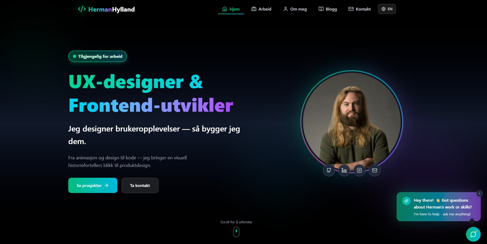

# Herman Portfolio 2

A modern, fully-featured portfolio website built with **React 19** and **Tailwind CSS**. This project showcases my work as a UX Designer & Frontend Developer, featuring multilingual support, an AI-powered assistant, comprehensive case studies, animation portfolio, and a beautiful dark-themed design.

## Before & After

<table>
<tr>
<td width="50%">

**Original Design (2024)**


</td>
<td width="50%">

**Current Design (2026)**



</td>
</tr>
</table>

## Live Site

**[portfolio-herman-hylland.netlify.app](https://portfolio-herman-hylland.netlify.app/)**

---

## Features

### Multilingual Support (i18n)
- Full **Norwegian** and **English** translations
- Automatic language detection based on browser settings
- Language switcher accessible from the header
- All content, pages, and case studies translated
- Powered by **i18next** and **react-i18next**

### AI-Powered Portfolio Assistant
- Interactive chatbot powered by **OpenAI GPT-4o-mini**
- Answers questions about my skills, projects, and experience
- **Clickable navigation links** - AI responses include links that navigate directly to relevant pages
- Comprehensive knowledge of all 10 case studies, blog articles, and portfolio sections
- Serverless backend using **Netlify Functions**
- Real-time responses with conversation context
- Beautiful gradient UI with smooth animations

> **Note:** The AI chatbot requires Netlify Functions. Use `npm run dev:netlify` for local testing, or test on the live site.

### Comprehensive Case Studies
10 detailed project case studies with:
- Full project breakdowns with problem statements and solutions
- Technology stack details
- Design process documentation
- Screenshots and visual galleries
- Links to live sites and repositories

**Featured Projects:**
- **Holidaze** - Accommodation booking platform
- **BrannVRn** - VR fire safety training
- **Own the Bid (Auction)** - Online auction platform
- **Hobbyist** - Social platform for hobby enthusiasts
- **Gone Fishing** - Fishing blog platform
- **Timer Planner** - Task scheduling application
- **Pia Salary** - Salary tracking tool
- **ClicketyCart** - E-commerce solution
- **Community Science Museum** - Museum website
- **GameHub** - Gaming community platform

### Animation Portfolio
8 animation showcases demonstrating:
- **After Effects character rigging** with DUIK
- Walk cycles, run cycles, and gesture animations
- Environment animations with day/night transitions
- **Unreal Engine 3D scenes** with VFX and cinematics
- Interactive 3D gallery experiences

### Dynamic Blog System
- Markdown-based blog posts with full CMS integration
- **Decap CMS** (formerly Netlify CMS) for easy content management
- Dynamic post loading using **vite-plugin-markdown**
- Rich text editor with frontmatter support
- Featured posts, tags, and read time estimates
- **RSS feed** auto-generation for subscribers

### Modern UI/UX
- Dark-themed design with gradient accents (emerald, cyan, purple)
- Smooth page transitions and scroll animations
- Responsive layout optimized for all devices
- Glass-morphism effects and animated borders
- Interactive starfield background
- Accessible navigation and keyboard support

### Additional Features
- **CV Download** - PDF resume in both English and Norwegian
- **Visitor Counter** - Anonymous visit tracking
- **SEO Optimized** - sitemap.xml, robots.txt, Open Graph images
- **Error Boundaries** - Graceful error handling
- **Optimized Images** - Lazy loading and performance optimization

---

## Tech Stack

### Frontend
| Technology | Purpose |
|------------|---------|
| React 19 | UI framework |
| Tailwind CSS 4 | Utility-first styling |
| Vite 6 | Fast build tool and dev server |
| React Router 7 | Client-side routing |
| i18next | Internationalization |
| Lucide React | Icon library |
| React Markdown | Markdown rendering |

### Backend & Services
| Technology | Purpose |
|------------|---------|
| Netlify Functions | Serverless API endpoints |
| OpenAI API | GPT-4o-mini for AI chatbot |
| Decap CMS | Git-based content management |
| Netlify Identity | Authentication |

### Build & Optimization
| Technology | Purpose |
|------------|---------|
| vite-plugin-markdown | Build-time markdown processing |
| Sharp | Image optimization |
| gray-matter | Frontmatter parsing |

---

## Project Structure

```
Herman-Portfolio-2/
├── content/
│   └── blog/                    # Markdown blog posts
├── netlify/
│   └── functions/               # Serverless functions (chatbot API)
├── public/
│   ├── admin/                   # Decap CMS admin interface
│   ├── Animasjoner/             # Animation videos and assets
│   ├── CV/                      # Downloadable CV files
│   ├── Illustrasjoner portfolio/# Illustration gallery
│   └── [project-folders]/       # Project screenshots and assets
├── scripts/
│   └── generate-rss.js          # RSS feed generation
├── src/
│   ├── components/              # 30+ reusable React components
│   │   ├── chatBot/             # AI assistant
│   │   ├── header/              # Navigation with language switcher
│   │   ├── heroSection/         # Homepage hero
│   │   ├── caseStudyHero/       # Case study headers
│   │   └── ...                  # Many more components
│   ├── data/                    # Static data and content
│   │   ├── animations.js        # Animation portfolio data
│   │   └── illustrations.js     # Illustration gallery data
│   ├── i18n/                    # Internationalization
│   │   ├── index.js             # i18next configuration
│   │   └── locales/
│   │       ├── en/              # English translations
│   │       │   ├── common.json
│   │       │   ├── features.json
│   │       │   ├── pages.json
│   │       │   └── content/     # Case studies & projects
│   │       └── no/              # Norwegian translations
│   │           └── ...
│   ├── pages/                   # Page components
│   │   ├── home/
│   │   ├── work/
│   │   ├── about/
│   │   ├── contact/
│   │   ├── blog/
│   │   ├── projectDetails/
│   │   ├── animationDetails/
│   │   └── caseStudy/           # 10 case study pages
│   │       ├── holidaze/
│   │       ├── brannvrn/
│   │       ├── auction/
│   │       └── ...
│   └── App.jsx                  # Main app with routing
├── CLAUDE.md                    # Development style guide
├── vite.config.js               # Vite configuration
└── tailwind.config.js           # Tailwind CSS configuration
```

---

## Getting Started

### Prerequisites
- Node.js v18 or higher
- npm or yarn
- Git

### Installation

1. **Clone the repository:**
   ```bash
   git clone https://github.com/Hermanhyl/Herman-Portfolio-2.git
   cd Herman-Portfolio-2
   ```

2. **Install dependencies:**
   ```bash
   npm install
   ```

3. **Create environment file:**
   ```env
   VITE_OPENAI_API_KEY=your_openai_api_key_here
   ```

4. **Start development server:**
   ```bash
   npm run dev
   ```
   > This starts only the Vite dev server. The AI chatbot won't work in this mode.

5. **For full local development (with AI chatbot):**
   ```bash
   npm run dev:netlify
   ```
   > This starts both Vite and Netlify Functions, enabling the AI chatbot locally.

### Build Commands

| Command | Description |
|---------|-------------|
| `npm run dev` | Start development server |
| `npm run dev:netlify` | Start with Netlify Functions |
| `npm run build` | Build for production (includes RSS generation) |
| `npm run preview` | Preview production build |
| `npm run lint` | Run ESLint |

---

## Content Management

### Blog Posts
1. Navigate to `/admin` on your deployed site
2. Login with Netlify Identity
3. Create, edit, or delete posts using the CMS interface
4. Posts automatically deploy via Git Gateway

### Adding New Translations
1. Add translation keys to both `src/i18n/locales/en/` and `src/i18n/locales/no/`
2. Use the `useTranslation` hook in components
3. Translations are organized by:
   - `common.json` - Navigation, buttons, labels
   - `features.json` - Feature descriptions
   - `pages.json` - Page-specific content
   - `content/` - Case studies and projects

---

## Environment Variables

| Variable | Description | Where to Set |
|----------|-------------|--------------|
| `VITE_OPENAI_API_KEY` | OpenAI API key (development) | `.env` file |
| `OPENAI_API_KEY` | OpenAI API key (production) | Netlify dashboard |

---

## Key Features Implemented

- [x] Full i18n support (Norwegian & English)
- [x] AI chatbot with OpenAI integration
- [x] 10 comprehensive project case studies
- [x] Animation portfolio with 8 showcases
- [x] Dynamic markdown-based blog system
- [x] CMS with authentication
- [x] RSS feed generation
- [x] CV download (bilingual)
- [x] Responsive mobile-first design
- [x] SEO optimization (sitemap, robots.txt, OG images)
- [x] Smooth animations and page transitions
- [x] Dark mode theme with gradient accents
- [x] Accessibility compliance (ARIA labels, keyboard nav)
- [x] Error boundaries for graceful error handling
- [x] Image optimization with lazy loading

---

## Author

**Herman Hylland**
UX Designer & Frontend Developer

- **Portfolio:** [portfolio-herman-hylland.netlify.app](https://portfolio-herman-hylland.netlify.app/)
- **LinkedIn:** [linkedin.com/in/herman-hylland](https://www.linkedin.com/in/herman-hylland/)
- **GitHub:** [github.com/Hermanhyl](https://github.com/Hermanhyl)
- **Email:** hermanhyl@hotmail.com

---

## License

This project is open source and available for educational purposes.

---

## Acknowledgments

- Built with React 19 and Tailwind CSS 4
- AI powered by OpenAI GPT-4o-mini
- Icons by Lucide React
- Hosted on Netlify
- CMS by Decap CMS
- Internationalization by i18next

---

Made with passion by Herman Hylland
